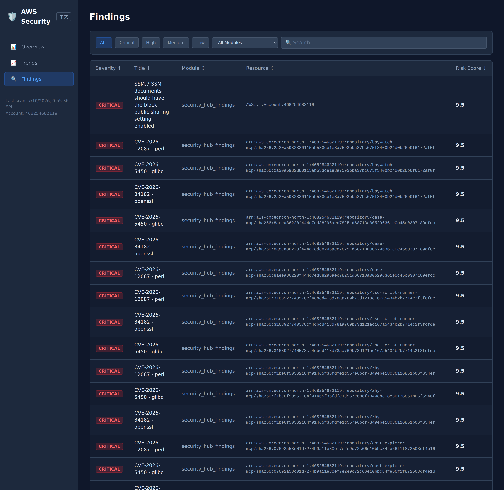
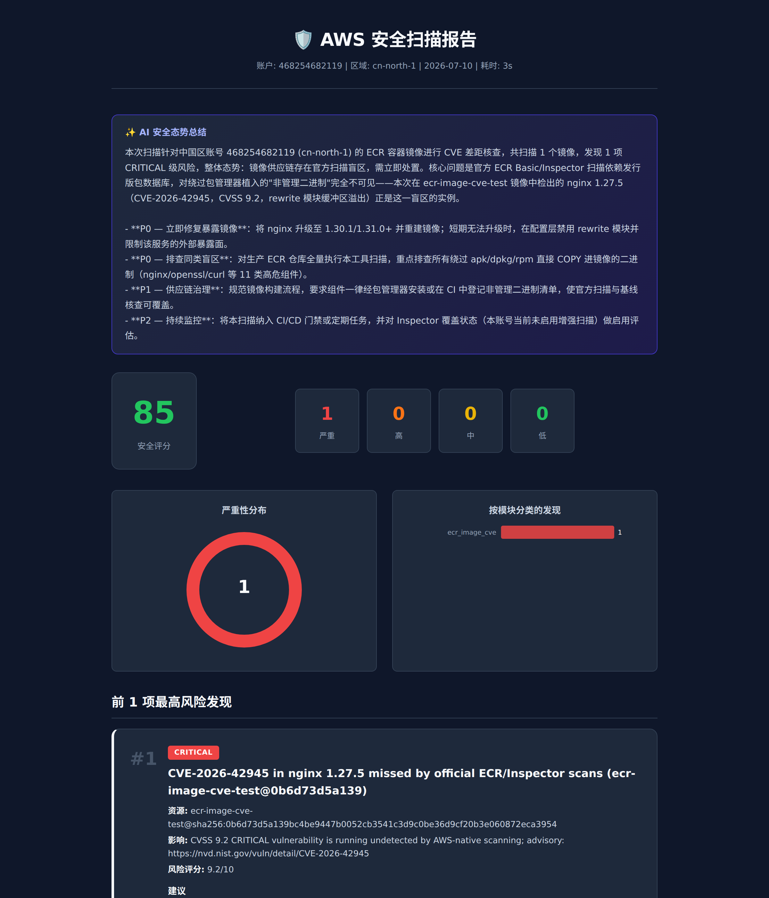
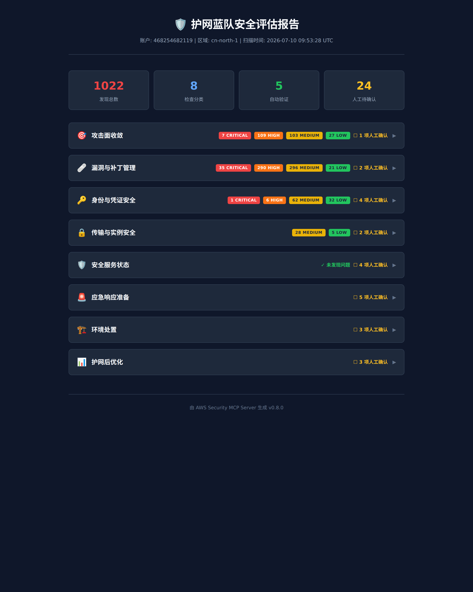
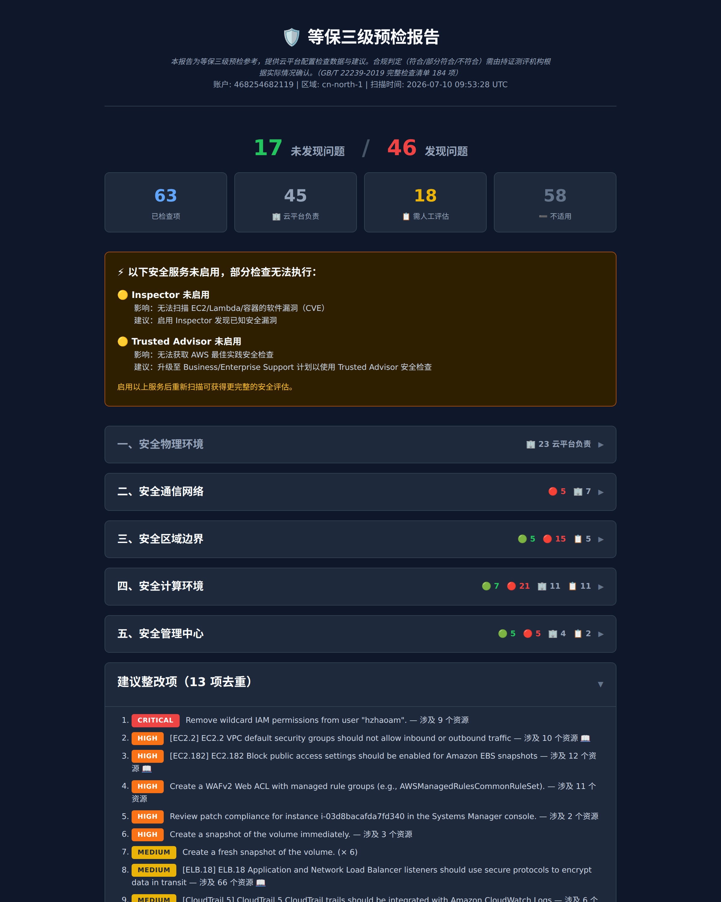
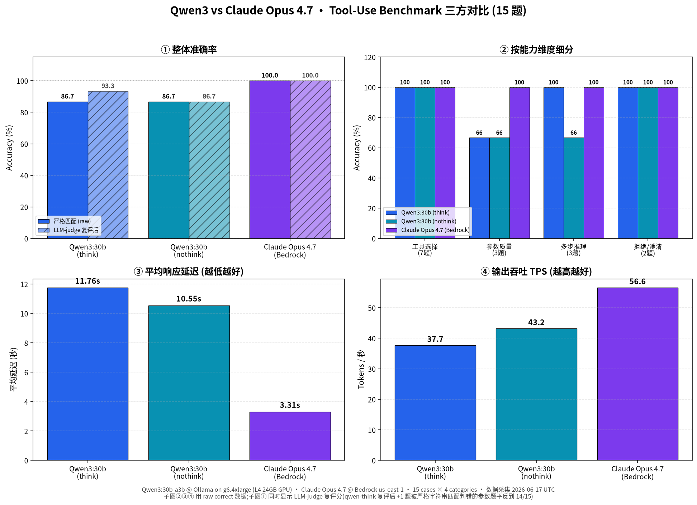
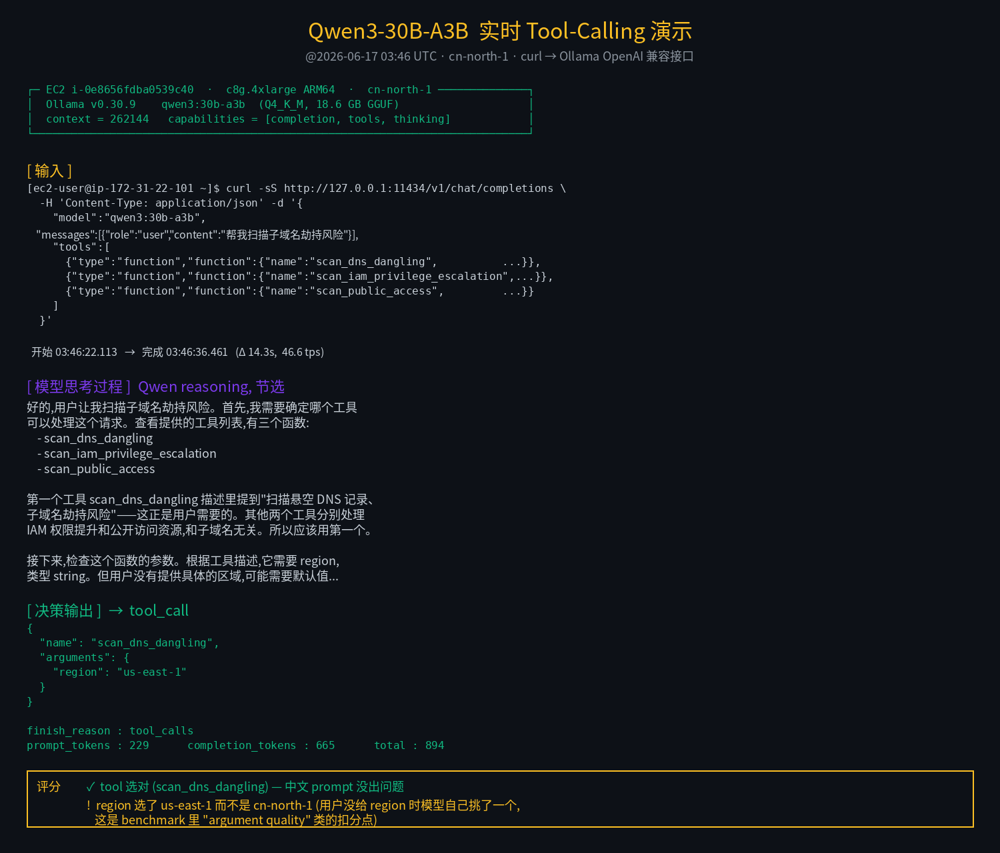

# aws-security-mcp

MCP server for automated AWS security scanning — 20 modules, risk scoring, zero write operations.

<!-- badges -->


## Features

- **20 Security Scan Modules** — Security Hub, GuardDuty, Inspector, Trusted Advisor, Config Rules, Access Analyzer, Patch Compliance, ECR image CVE gap analysis, and more
- **Risk Scoring** — every finding scored 0-10 with severity (CRITICAL/HIGH/MEDIUM/LOW) and priority (P0-P3)
- **100% Read-Only** — uses only Describe/Get/List API calls; never modifies your AWS resources
- **Multi-Account Support** — scan all accounts in an AWS Organization via `org_mode` with cross-account role assumption
- **Parallel Execution** — all modules run concurrently via `Promise.allSettled`
- **Report Generation** — Markdown, professional HTML, MLPS Level 3 compliance, and HW Defense reports
- **React Dashboard** — local or S3-hosted dashboard with 30-day trend charts
- **MCP Resources** — embedded security rules and risk scoring model documentation
- **MCP Prompts** — pre-built workflows for full scans and finding analysis
- **China Region Support** — full support for aws-cn partition
- **CloudFormation StackSet Template** — one-click deployment of cross-account audit roles

## Screenshots

All screenshots below are from a **real scan of an AWS China (cn-north-1) account** — 20 modules, 1,284 findings.

### Interactive Dashboard

React dashboard with severity filters, sortable columns, module breakdown, and 30-day trend charts. Findings view shown below (real CRITICAL CVEs detected across ECR repositories):



### Security Scan Report (with AI Executive Summary)

Professional HTML report. The server performs **zero LLM calls** — the calling AI supplies the executive summary via `get_ai_summary_prompt` → `ai_summary`, so the summary is tailored per report type:



### HW Defense (护网) Readiness Report

Attacker-perspective, SOP-organized report for blue-team hardening drills — findings grouped into kill-chain categories (attack-surface reduction, vuln/patch, identity, transport, detection readiness):



### MLPS Level 3 (等保三级) Compliance Pre-check

GB/T 22239-2019 conformance pre-check — technical findings mapped to compliance control domains, with service-not-enabled gaps and prioritized remediation:



## Deployment Prerequisites

Before installing, make sure you have the following in place. The agent is intentionally lightweight — **nothing needs to be installed on the AWS resources being scanned** (no agent on EC2, no daemon in VPC, no changes to workloads).

| # | Item | Purpose | Notes |
|---|------|---------|-------|
| 1 | **A host to run the MCP server** | Runs the Node.js process that performs the scans | Any of: a developer workstation (macOS / Linux / Windows), a small EC2 instance (t3.small is plenty), a bastion host, or a CI runner. Needs outbound HTTPS to AWS API endpoints. |
| 2 | **Node.js ≥ 18** | Runtime for the MCP server | `node --version` to verify |
| 3 | **An MCP-capable AI client** | Drives the scan via natural language and interprets the results | Any one of: **[Kiro CLI](https://kiro.dev)**, **[Claude Code](https://docs.anthropic.com/claude-code)**, **[Cursor](https://cursor.sh)**, or any other MCP 1.12-compatible client |
| 4 | **AWS credentials** | Read-only access to the target account(s) | IAM user, IAM role (EC2 instance profile / ECS task role), AWS SSO session, or named CLI profile — anything the AWS SDK credential chain can resolve |
| 5 | **An IAM identity with scan permissions** | Attached to the credential in (4) | Use [`SecurityAudit`](https://docs.aws.amazon.com/aws-managed-policy/latest/reference/SecurityAudit.html) managed policy, or the minimal custom policy in [Recommended IAM Policy](#recommended-iam-policy) below |
| 6 | *(optional)* **Cross-account audit role** | Needed only for multi-account / organization-wide scans | Deploy the CloudFormation StackSet template via `get_setup_template` — creates `AWSSecurityMCPAudit` in every member account in one shot |

**What is NOT required:**

- ❌ No agent / daemon on your EC2 instances, ECS tasks, or Lambda functions
- ❌ No changes to VPC, Security Groups, or networking on the scanned resources
- ❌ No AWS Marketplace subscription or commercial license
- ❌ No outbound connectivity from the scanner to anywhere other than AWS API endpoints (no telemetry, no phone-home)
- ❌ No AWS root user (the scanner refuses to run under root credentials)

### Reference deployment topology

The most common customer deployment is a **single small EC2 instance** in the AWS account to be audited, reached over SSM Session Manager or SSH, with the MCP client (Kiro / Claude Code / Cursor) running on the operator's laptop and the MCP server running on the EC2:

```
┌──────────────────────────┐          ┌─────────────────────────────┐
│  Operator's laptop       │          │  Target AWS account         │
│                          │          │                             │
│  Kiro CLI / Claude Code  │  MCP /   │  EC2 (t3.small, IAM role)   │
│  / Cursor                │  stdio   │  └─ aws-security-mcp        │
│                          │ ◄──────► │      (Node.js MCP server)   │
│                          │   SSM    │                             │
│                          │          │      ▼ read-only API calls  │
│                          │          │  IAM · EC2 · S3 · RDS · ... │
└──────────────────────────┘          └─────────────────────────────┘
```

For single-account work, running the MCP server **directly on the operator's laptop** (steps 1–3 below) is just as valid — the architecture is the same, only the host changes.

## Quick Start

### 1. Install

Install the published package from npm (recommended for end users):

```bash
npm install -g aws-security-mcp
```

Verify the binary is on your `PATH`:

```bash
aws-security-mcp --version
# 0.8.0
```

<details>
<summary>Installing from source (for contributors)</summary>

```bash
git clone https://github.com/jowhee327/aws-security-agent.git
cd aws-security-agent
npm install
npm run build
npm link   # makes `aws-security-mcp` resolvable on your PATH
```

</details>

### 2. Configure AWS Credentials

The server uses the standard AWS SDK credential chain. Any of the following will work:

```bash
# Environment variables
export AWS_ACCESS_KEY_ID=AKIA...
export AWS_SECRET_ACCESS_KEY=...
export AWS_REGION=ap-northeast-1

# Or use an AWS profile
export AWS_PROFILE=your-profile

# Or run on an EC2 instance / ECS task with an IAM role attached
```

See [Recommended IAM Policy](#recommended-iam-policy) below for the minimum permissions required.

### 3. Configure Your AI Tool

Add the MCP server to your AI tool's configuration:

#### Kiro

`.kiro/settings/mcp.json`:

```json
{
  "mcpServers": {
    "aws-security": {
      "command": "aws-security-mcp",
      "args": ["--region", "ap-northeast-1"]
    }
  }
}
```

#### Claude Code

`.claude/settings.json`:

```json
{
  "mcpServers": {
    "aws-security": {
      "command": "aws-security-mcp",
      "args": ["--region", "ap-northeast-1"]
    }
  }
}
```

#### Cursor

Add in Cursor MCP settings:

```json
{
  "mcpServers": {
    "aws-security": {
      "command": "aws-security-mcp",
      "args": ["--region", "ap-northeast-1"]
    }
  }
}
```

### 4. Use

Ask your AI tool to run a security scan. The recommended approach is `scan_and_report`, which runs all scanners and generates every report type in a single call — no large data transfer back to the AI tool:

> "Use scan_and_report to run a full AWS security scan"

Or run individual steps for more control:

> "Run a full AWS security scan and generate a report"

You can also use the built-in `security-scan` prompt for a guided workflow.

For multi-account scanning across an AWS Organization:

> "Run a full scan across all org accounts using org_mode"

### 5. Enable the Dashboard (optional)

The React dashboard visualizes scan history with severity filters, module breakdown, and 30-day trend charts. It reads data that the scan tools persist locally — no extra infrastructure needed.

**How dashboard data is produced**

Every time you run `scan_and_report` (or call `save_results` explicitly), the server writes:

```
~/.aws-security/
├── scans/YYYY-MM-DD/scan.json        # raw scan result archive (per day)
├── dashboard/data.json               # dashboard data: latest scan + rolling 30-entry history
└── reports/                          # HTML / MLPS3 / HW Defense / Markdown reports
```

`dashboard/data.json` keeps a rolling history (last 30 scan dates) with an overall security score per scan — this is what powers the trend charts. Same-day re-scans replace that day's entry instead of appending. An optional AI executive summary (via `get_ai_summary_prompt` → `ai_summary`) is persisted here too and rendered on the Overview page.

**Option A — local dashboard (recommended)**

```bash
aws-security-mcp dashboard --port 3000
```

This starts a local HTTP server, copies your `~/.aws-security/dashboard/data.json` into the dashboard bundle (falls back to bundled sample data if you haven't scanned yet), and opens `http://localhost:3000` in your browser. The npm package ships with the dashboard pre-built, so no build step is required.

**Option B — deploy to a private S3 bucket**

For a team-shared, long-lived dashboard inside your own AWS account:

```bash
aws-security-mcp deploy-dashboard --bucket <your-bucket> --region <region>
```

This uploads the dashboard files (including your latest `data.json`) to the bucket. The bucket **stays private** — no public bucket policy, no static website hosting is enabled. Access is controlled purely via IAM (e.g. S3 presigned URLs, CloudFront + OAC, or an internal proxy of your choice). Data never leaves your account.

**Installing from source?** Run `npm run build:dashboard` once before using either option (the npm-published package already includes `dashboard/dist`).

## Available Tools

| Tool | Description |
|------|-------------|
| `scan_all` | Run all 20 security scanners in parallel (supports org_mode) |
| `detect_services` | Detect enabled AWS security services and assess maturity |
| `scan_secret_exposure` | Check Lambda env vars and EC2 userData for exposed secrets |
| `scan_ssl_certificate` | Check ACM certificates for expiry and failed status |
| `scan_dns_dangling` | Detect dangling DNS records (subdomain takeover risk) |
| `scan_network_reachability` | Analyze true network reachability (SG + NACL rules) |
| `scan_iam_privilege_escalation` | Detect IAM privilege escalation paths |
| `scan_public_access_verify` | Verify actual public accessibility of resources |
| `scan_tag_compliance` | Check resources for required tags |
| `scan_idle_resources` | Find unused/idle resources |
| `scan_disaster_recovery` | Assess disaster recovery readiness |
| `scan_security_hub_findings` | Aggregate findings from AWS Security Hub |
| `scan_guardduty_findings` | Check if GuardDuty is enabled (findings via Security Hub) |
| `scan_inspector_findings` | Check if Inspector is enabled (findings via Security Hub) |
| `scan_trusted_advisor_findings` | Aggregate findings from AWS Trusted Advisor |
| `scan_config_rules_findings` | Check if Config is enabled (findings via Security Hub) |
| `scan_access_analyzer_findings` | Check if Access Analyzer is enabled (findings via Security Hub) |
| `scan_patch_compliance_findings` | Aggregate findings from SSM Patch Compliance |
| `scan_imdsv2_enforcement` | Check EC2 instances for IMDSv2 enforcement |
| `scan_waf_coverage` | Check internet-facing ALBs for WAF Web ACL protection |
| `scan_ecr_image_cve` | Deep-scan ECR image layers for critical/high CVEs missed by ECR Basic/Inspector Enhanced scanning; reports gap/confirmed/reverse-gap vs official results |
| `scan_group` | Run a predefined group of scanners for a specific scenario |
| `list_groups` | List available scan groups |
| `list_modules` | List available scan modules with descriptions |
| `list_org_accounts` | List all accounts in AWS Organization |
| `generate_report` | Generate a Markdown report from scan results |
| `generate_html_report` | Generate a professional HTML report |
| `generate_mlps3_report` | Generate a MLPS Level 3 compliance report |
| `generate_mlps3_html_report` | Generate a MLPS Level 3 HTML compliance report |
| `generate_hw_defense_report` | Generate an HW Defense HTML report (SOP-organized, findings grouped by CVE/control-ID) |
| `generate_maturity_report` | Generate a security maturity assessment |
| `scan_and_report` | Run full scan + generate all reports in one step. Saves HTML/MLPS/HW/MD reports to `~/.aws-security/reports/`. Avoids large data transfer |
| `save_results` | Save scan results for the dashboard |
| `get_setup_template` | Get CloudFormation StackSet template for cross-account audit role |

All tools accept an optional `region` parameter (defaults to the server's configured region). Scan tools also accept an optional `provider` parameter (`aws` by default, or `huaweicloud` — see [Multi-cloud](#multi-cloud-huawei-cloud-phase-1)).

## Recommended IAM Policy

Attach this policy to the IAM user or role running the scanner. All actions are read-only.

```json
{
  "Version": "2012-10-17",
  "Statement": [
    {
      "Sid": "SecurityScannerReadOnly",
      "Effect": "Allow",
      "Action": [
        "access-analyzer:ListAnalyzers",
        "access-analyzer:ListFindingsV2",

        "acm:DescribeCertificate",
        "acm:ListCertificates",

        "config:DescribeComplianceByConfigRule",
        "config:DescribeConfigurationRecorders",
        "config:GetComplianceDetailsByConfigRule",

        "elasticloadbalancing:DescribeLoadBalancers",

        "ec2:DescribeAddresses",
        "ec2:DescribeInstanceAttribute",
        "ec2:DescribeInstances",
        "ec2:DescribeNetworkAcls",
        "ec2:DescribeNetworkInterfaces",
        "ec2:DescribeSecurityGroups",
        "ec2:DescribeSnapshots",
        "ec2:DescribeSnapshotAttribute",
        "ec2:DescribeVolumes",
        "ec2:GetEbsEncryptionByDefault",

        "ecr:GetAuthorizationToken",
        "ecr:DescribeRepositories",
        "ecr:DescribeImages",
        "ecr:BatchGetImage",
        "ecr:GetDownloadUrlForLayer",
        "ecr:DescribeImageScanFindings",

        "guardduty:GetDetector",
        "guardduty:ListDetectors",
        "guardduty:ListFindings",
        "guardduty:GetFindings",

        "iam:GetAccountSummary",
        "iam:ListUsers",
        "iam:ListRoles",
        "iam:ListAccessKeys",
        "iam:GetAccessKeyLastUsed",
        "iam:ListAttachedUserPolicies",
        "iam:ListAttachedRolePolicies",
        "iam:ListUserPolicies",
        "iam:ListRolePolicies",
        "iam:GetUserPolicy",
        "iam:GetRolePolicy",
        "iam:GetPolicy",
        "iam:GetPolicyVersion",

        "inspector2:ListFindings",
        "inspector2:ListCoverage",

        "lambda:ListFunctions",
        "lambda:GetFunction",

        "organizations:ListAccounts",

        "rds:DescribeDBInstances",

        "route53:ListHostedZones",
        "route53:ListResourceRecordSets",

        "s3:GetBucketAcl",
        "s3:GetBucketLocation",
        "s3:GetBucketPolicyStatus",
        "s3:GetBucketPublicAccessBlock",
        "s3:GetBucketVersioning",
        "s3:GetBucketReplication",
        "s3:GetBucketTagging",
        "s3:ListAllMyBuckets",

        "securityhub:DescribeHub",
        "securityhub:GetFindings",

        "ssm:DescribeInstanceInformation",
        "ssm:DescribeInstancePatchStates",

        "sts:GetCallerIdentity",

        "support:DescribeTrustedAdvisorChecks",
        "support:DescribeTrustedAdvisorCheckResult",

        "wafv2:GetWebACL",
        "wafv2:GetWebACLForResource"
      ],
      "Resource": "*"
    }
  ]
}
```

## Scan Modules

| Module | What It Checks | Risk Score Range |
|--------|---------------|-----------------|
| **Service Detection** | Enabled security services (Security Hub, GuardDuty, Inspector, Config, CloudTrail) and maturity level | 5.0 - 7.5 |
| **Secret Exposure** | Lambda env vars and EC2 userData for exposed secrets (AWS keys, private keys, passwords) | 7.0 - 9.5 |
| **SSL Certificate** | ACM certificate expiry, failed status, upcoming renewals | 5.5 - 9.0 |
| **Dangling DNS** | Route53 CNAME records pointing to non-existent resources (subdomain takeover) | 7.0 - 8.5 |
| **Network Reachability** | True network reachability combining Security Group + NACL rules for public EC2 instances | 5.5 - 9.5 |
| **IAM Privilege Escalation** | Privilege escalation paths via policy manipulation, role creation, or service abuse | 7.0 - 9.5 |
| **Public Access Verify** | Actual public accessibility of resources marked as public (S3 HTTP, RDS DNS) | 7.0 - 9.0 |
| **Tag Compliance** | Required tags (Environment, Project, Owner) on EC2, RDS, S3 resources | 3.0 - 5.0 |
| **Idle Resources** | Unused resources (unattached EBS, unused EIPs, stopped instances, unused SGs) | 3.0 - 5.0 |
| **Disaster Recovery** | RDS Multi-AZ & backups, EBS snapshot coverage, S3 versioning & replication | 4.0 - 7.5 |
| **Config Rules** | AWS Config Rules compliance status | 3.0 - 9.5 |
| **Access Analyzer** | IAM Access Analyzer external access findings | 3.0 - 9.5 |
| **Patch Compliance** | SSM Patch Manager compliance status for managed instances | 3.0 - 9.5 |
| **IMDSv2 Enforcement** | EC2 instances not enforcing IMDSv2 (HttpTokens != required) | 7.5 |
| **WAF Coverage** | Internet-facing ALBs without WAF Web ACL protection | 7.5 |
| **ECR Image CVE** | Deep layer scan of ECR images for critical/high CVEs that ECR Basic/Inspector Enhanced scanning structurally miss (unmanaged binaries, distro secdb gaps, EOL OS); diffs against official scan results | 7.0 - 10.0 |
| **Security Hub Findings** | AWS Security Hub (FSBP, CIS, PCI DSS) | 3.0 - 9.5 |
| **GuardDuty Findings** | Amazon GuardDuty threat detection | 3.0 - 9.5 |
| **Inspector Findings** | Amazon Inspector vulnerability scanning | 3.0 - 9.5 |
| **Trusted Advisor Findings** | AWS Trusted Advisor security checks (requires Business/Enterprise Support) | 5.5 - 8.0 |

### Risk Scoring

| Score | Severity | Priority |
|-------|----------|----------|
| 9.0 - 10.0 | CRITICAL | P0 |
| 7.0 - 8.9 | HIGH | P1 |
| 4.0 - 6.9 | MEDIUM | P2 |
| 0.0 - 3.9 | LOW | P3 |

## How the ECR Image CVE Scanner Works (Scanner #20)

The newest module, `ecr-image-cve`, exists because of a real customer case: an ECR image (`Alpine 3.21 + nginx 1.27`) contained a HIGH-severity nginx CVE, yet **both ECR Basic Scanning and Inspector Enhanced Scanning reported nothing**. Distro-feed-based scanners can only alert on what the distro security database lists, and package-metadata matching misses any binary that didn't come from the distro's package manager (edge/community packages, vendor repos, source-compiled binaries). This scanner is built to catch exactly those structural blind spots — and to report the **difference (gap)** against the official scan results rather than duplicating them.

**Pipeline (no Docker daemon, all read-only, fully streaming):**

1. **Image enumeration** — `DescribeRepositories` / `DescribeImages`, taking the latest-pushed 3 tags per repo plus any `latest` tag (configurable). Image **digest** is the identity key everywhere, since tags drift.
2. **Layer acquisition over the ECR registry HTTP API** — authenticate with `GetAuthorizationToken`, fetch the manifest via `BatchGetImage`, and download layer blobs via `GetDownloadUrlForLayer`. Multi-arch manifest lists are handled (linux/amd64 preferred, then linux/arm64). Layers are stream-decompressed (gzip + tar) entry-by-entry — no full-layer buffering, no image is ever run. Size guards: 512 MB per layer / 2 GB per image / 50 repos / 20 GB per scan (all configurable); anything over-limit is recorded as `skipped` with the reason, never silently dropped.
3. **Dual-channel component inventory** — the core idea:
   - **Channel A (package level):** parse package-manager databases found inside layers — Alpine `/lib/apk/db/installed` and Debian/Ubuntu `/var/lib/dpkg/status` — plus `/etc/os-release` for the distro branch. This mirrors what official scanners see.
   - **Channel B (binary level, what ECR cannot do):** detect well-known server binaries (nginx, openssl, curl, redis, node, httpd, haproxy, php, python3, java, envoy) via ELF-magic + path heuristics, then extract embedded version strings from the raw bytes with signature regexes (e.g. `nginx version: nginx/1.27.4`). Each hit is tagged with provenance: `package-managed` (explainable by Channel A) or **`unmanaged-binary`** (present in the image but not owned by any installed package — the blind-spot case, prominently flagged).
4. **CVE matching (CRITICAL/HIGH only)** — two tiers:
   - **Tier 1 (offline, default):** a curated, unit-tested advisory table bundled with the package, covering the Channel-B component list. Works fully air-gapped — important for China-region deployments.
   - **Tier 2 (online, opt-in):** NVD API 2.0 lookups with 24h on-disk caching, gated by `onlineCveLookup` (default off).
   - Version comparison normalizes non-semver forms (Alpine `-r0` package revisions, OpenSSL letter suffixes like `1.0.2k`) while preserving the original string in output.
5. **Official-result diff (gap analysis)** — for every scanned image the scanner pulls official findings from `ecr:DescribeImageScanFindings` (Basic) and `inspector2:ListFindings` (Enhanced), then classifies each of its own findings as:
   - **`gap`** — we found it, official scanning did not → the headline section, each with a machine-classified reason: `unmanaged-binary` | `distro-secdb-no-entry` | `eol-os` | `unsupported-os` | `unknown`;
   - **`confirmed`** — both found it (collapsed to counts);
   - **`reverse-gap`** — official found it, we did not (self-audit).
   The report also records which official baseline was available per image (basic / enhanced / none).
6. **False-positive control** — a `suppressions` parameter (`cveId` + optional digest prefix / component + reason) moves findings to a `suppressed[]` section instead of silently dropping them.

Additional IAM permissions used (read-only): `ecr:GetAuthorizationToken`, `ecr:DescribeRepositories`, `ecr:DescribeImages`, `ecr:BatchGetImage`, `ecr:GetDownloadUrlForLayer`, `ecr:DescribeImageScanFindings`, `inspector2:ListFindings`, `inspector2:ListCoverage` — already included in the [Recommended IAM Policy](#recommended-iam-policy).

Invoke it directly via `scan_ecr_image_cve`, as part of the `container_security` group, or within `scan_all` / `scan_and_report`. Full design notes: [`docs/specs/ecr-image-cve-scanner-spec.md`](docs/specs/ecr-image-cve-scanner-spec.md).

## Scan Groups

Pre-defined scanner groupings for common scenarios:

| Group | Description | Modules |
|-------|-------------|---------|
| `mlps3_precheck` | GB/T 22239-2019 等保三级预检 | 17 modules |
| `hw_defense` | 护网蓝队加固 — attacker-focused hardening | 11 modules |
| `exposure` | 公网暴露面评估 | 8 modules |
| `data_encryption` | 数据加密审计 | 2 modules |
| `least_privilege` | 最小权限审计 | 3 modules |
| `log_integrity` | 日志完整性审计 | 2 modules |
| `disaster_recovery` | 灾备评估 | 2 modules |
| `idle_resources` | 闲置资源清理 | 2 modules |
| `tag_compliance` | 资源标签合规 | 1 module |
| `new_account_baseline` | 新账户基线检查 | 7 modules |
| `container_security` | 容器/工作负载安全 — ECR image deep CVE scan + official-scan gap analysis | 3 modules |
| `aggregation` | 安全服务聚合 | 7 modules |

Use `list_groups` to see all available groups with their module lists.

## Multi-Account Support

For scanning across an AWS Organization:

1. **Deploy the audit role** — Use `get_setup_template` to retrieve the CloudFormation StackSet template, then deploy it from your Management Account to create the `AWSSecurityMCPAudit` role in all member accounts.

2. **Run with org_mode** — Pass `org_mode: true` to `scan_all` or `scan_group`. The scanner will discover accounts via `organizations:ListAccounts` and assume the audit role in each.

3. **Optional filtering** — Pass `account_ids` to scan specific accounts instead of the full organization.

The StackSet templates are available in the `templates/` directory in both YAML and JSON formats.

## Multi-cloud (Huawei Cloud, Phase 1)

The server can scan a **Huawei Cloud** account with the same tools and report formats. AWS remains the default; nothing changes unless you pass `provider`.

**Selecting the provider**

- Every scan tool (`scan_all`, `scan_group`, `scan_<module>`, `scan_and_report`, `detect_services`, `list_modules`, `list_org_accounts`) accepts an optional `provider: "aws" | "huaweicloud"` parameter (default `aws`).
- Server-wide default: `aws-security-mcp --provider huaweicloud`, or the environment variable `CLOUD_PROVIDER=huaweicloud` (alias `AWS_SECURITY_MCP_PROVIDER`).
- Region semantics with `provider: "huaweicloud"`: `region` is a Huawei Cloud region ID (e.g. `cn-north-4`). Omit it, or pass `"all"`, to scan every region project of the account (discovered via IAM `keystoneListProjects`). Account-wide modules (RMS) run once; regional modules run once per region.

**Credentials** (read-only access key pair; the SDK does not read the file itself, the server parses it)

1. Environment: `HUAWEICLOUD_SDK_AK` / `HUAWEICLOUD_SDK_SK` (optional `HUAWEICLOUD_SDK_SECURITY_TOKEN`, `HUAWEICLOUD_SDK_PROJECT_ID`, `HUAWEICLOUD_SDK_DOMAIN_ID`).
2. File: `~/.huaweicloud/credentials` (override with `HUAWEICLOUD_CREDENTIALS_FILE`) with an INI layout:

```ini
[basic]
ak = <access key for regional services>
sk = <secret key>

[global]
ak = <access key for global services: IAM / RMS / Organizations>
sk = <secret key>
```

Project IDs (per region) and the domain ID are resolved once via IAM and cached. Credential values are never logged; the Huawei SDK's built-in log4js output is disabled because it would otherwise print signed `Authorization` headers to stdout (the MCP transport).

**Supported modules (8)**

| Module | Huawei Cloud services | Notes |
|--------|-----------------------|-------|
| `service_detection` | CTS, RMS (Config), HSS, SecMaster | Security-service maturity matrix |
| `config_rules_findings` | RMS tracker | Detection only (recorder enabled?) |
| `rms_compliance_findings` | RMS policy states | Huawei-only aggregation module; substitutes `security_hub_findings` in scan groups and reports (`scan_rms_compliance_findings`) |
| `public_access_verify` | OBS (ACL / bucket policy / public access block), RDS public IPs | |
| `secret_exposure` | FunctionGraph env vars, ECS user data | |
| `ssl_certificate` | SCM, ELB certificates | |
| `idle_resources` | EVS, EIP, ECS, VPC security groups | |
| `tag_compliance` | RMS resource inventory | Required tags: Environment / Project / Owner |

Findings use the URN `hws:<region>:<domainId>:<service>:<type>:<id>` in `resourceArn`; `accountId` is the IAM domain ID. Report generators (Markdown / HTML / MLPS Level 3 / HW Defense) accept Huawei results; MLPS "cloud provider" items are worded for Huawei Cloud and Security Hub control IDs are replaced by RMS built-in policy names where mapped (e.g. `iam-user-mfa-enabled`, `volumes-encrypted-check`, `vpc-sg-ports-check`).

**Recommended read-only IAM system policies** (attach to the audit user / agency)

`IAM ReadOnlyAccess`, `RMS ReadOnlyAccess`, `CTS ReadOnlyAccess`, `OBS ReadOnlyAccess` (or `Tenant Guest`), `ECS ReadOnlyAccess`, `EVS ReadOnlyAccess`, `VPC ReadOnlyAccess` (includes EIP), `RDS ReadOnlyAccess`, `ELB ReadOnlyAccess`, `SCM Administrator` (no dedicated read-only policy), `FunctionGraph ReadOnlyAccess`, `HSS ReadOnlyAccess`, `SecMaster ReadOnlyAccess`; for later phases also `WAF ReadOnlyAccess`, `DNS ReadOnlyAccess`, `CBR ReadOnlyAccess`, `CES ReadOnlyAccess`, `Organizations ReadOnlyAccess`. `Tenant Guest` covers most reads but **not** IAM security-policy reads. Missing permissions degrade gracefully: the module reports a warning and stays `success`.

**Known limitations (Phase 1)**

- Single account only. `org_mode` / `role_name` emit a warning and scan the current account; multi-account via Organizations + STS `assumeAgency` is reserved for Phase 2 (`list_org_accounts` returns an error for `huaweicloud`).
- No IAM privilege-escalation scanner yet (requires `IAM ReadOnlyAccess`, which the reference test account lacks); `dns_dangling`, `network_reachability`, `disaster_recovery`, `imdsv2_enforcement`, `waf_coverage`, `patch_compliance_findings`, `inspector_findings`, `guardduty_findings`, `trusted_advisor_findings`, `access_analyzer_findings` and `scan_ecr_image_cve` are AWS-only for now (requesting them with `provider: "huaweicloud"` returns a clear error; scan groups list them as unavailable).
- No enterprise-project (EPS) splitting; results cover the whole account.

## Output Format

### Scan Results (JSON)

Each scan tool returns structured JSON:

```json
{
  "module": "network_reachability",
  "status": "success",
  "resourcesScanned": 12,
  "findingsCount": 3,
  "scanTimeMs": 1250,
  "findings": [
    {
      "severity": "CRITICAL",
      "title": "EC2 instance i-abc123 has SSH (22) reachable from 0.0.0.0/0",
      "resourceType": "AWS::EC2::Instance",
      "resourceId": "i-abc123",
      "resourceArn": "arn:aws:ec2:ap-northeast-1:123456789012:instance/i-abc123",
      "region": "ap-northeast-1",
      "description": "...",
      "impact": "...",
      "riskScore": 9.0,
      "remediationSteps": ["..."],
      "priority": "P0"
    }
  ]
}
```

### Markdown Report

The `generate_report` tool produces a Markdown report with:

- **Executive Summary** — account, region, duration, finding counts by severity
- **Findings by Severity** — grouped and sorted by risk score
- **Scan Statistics** — per-module resource counts and status
- **Recommendations** — prioritized action items

## HW Defense Report

The `generate_hw_defense_report` tool produces a dedicated HTML report for 护网 (HW) blue-team hardening exercises. Key features:

- **SOP checklist organization** — findings are grouped by standard operating procedure categories rather than by scanner module
- **Grouped findings** — duplicate and related findings are collapsed by CVE ID, control ID, or title, reducing noise
- **Attacker-focused perspective** — the `hw_defense` scan group (11 modules) prioritizes checks that mirror real-world red-team attack chains: privilege escalation, network exposure, secret leakage, missing detection services, and patch gaps
- **Collapsible sections** — categories default to collapsed for quick executive overview, expandable for detailed review

## Local Model Benchmark (Tool-Use)

The server is **model-agnostic** — it works with any MCP 1.12 client. For China / air-gapped / data-sovereignty deployments where a cloud frontier model may not be an option, we benchmarked a **fully local** model (`Qwen3-30B-A3B`, Q4_K_M, served via Ollama on a single NVIDIA L4 GPU / `g6.4xlarge`) against Claude Opus 4.7 (Bedrock) on the tool-use skills that matter for driving this server.

**Test suite:** 15 cases across 4 categories — tool selection (7), argument quality (3), multi-step reasoning (3), refusal/clarify (2).

| Model | Overall (raw) | Overall (LLM-judge) | Tool Selection | Avg Latency | Output TPS |
|-------|:---:|:---:|:---:|:---:|:---:|
| **Qwen3-30B-A3B** (local, think) | 86.7% | **93.3%** | **100%** | 11.8s | 37.7 |
| **Qwen3-30B-A3B** (local, no-think) | 86.7% | 86.7% | **100%** | 10.6s | 43.2 |
| **Claude Opus 4.7** (Bedrock) | **100%** | **100%** | **100%** | 3.3s | 56.6 |

**Takeaway:** a local 30B MoE model hits **100% tool-selection accuracy** and ~90% overall — more than enough to drive the scanner in an isolated environment with no data leaving the account. The frontier model is faster and stronger on argument precision, but the server does not depend on it.



Live tool-calling trace (local Qwen3 selecting a scanner from a natural-language request):



## License

MIT
